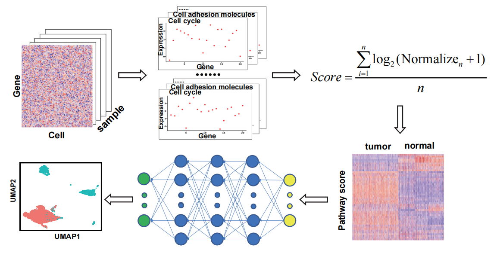

# TCfinder

TCfinder is a tool for predicting tumor cells and normal cells in single-cell data based on pathway scores.

## Workflow



## Installation and use of TCfinder package.

TCfinder, as an R package, can be downloaded and used via Github. TCfinder relies on several R packages, and these dependencies include：

***R (>= 3.5.0);***

***dplyr (>= 1.1.0);***

***reticulate (>= 1.2.6);***

***Matrix;***

***fs;***

### Install

```R
devtools::install_github("XSLiuLab/TCfinder")
```

TCfinder contains three functions, which respectively standardize the raw counts of single cells, score pathways, and predict tumor cells and normal cells. 

### Data normalization

The input data needs to be a sparse matrix or data.frame data whose row name is gene name and column name is sample name.

If the single-cell sequencing method used is smart-seq2, method = "smart-seq2" is required, and needed to select genome = "hg19" or "hg38". For other single-cell sequencing methods, this parameter does not need to be filled in.

```R
library(TCfinder)
result1 <- data_normalized(expr_data = expr_data,method = "method",genome = "hg38")
```

#### Example:

The row name is gene symbol, and the column name is barcode of the sample.

|         | AAACCTGCACATCCGG | ...  | AAACGGGGTTGAACTC | AAACGGGGTTGTCGCG |
| :-----: | :--------------: | ---- | :--------------: | :--------------: |
| FAM138A |        0         | ...  |        0         |        1         |
|  OR4F5  |        8         | ...  |        20        |        15        |
|   ...   |       ...        | ...  |       ...        |       ...        |
| FAM87B  |        1         | ...  |        0         |        1         |

### Pathway score

The path score is calculated using the built-in 213 pathways according to the formula in workflow. 

The output of data_normalized() can be directly used as the input of pathway_score(). If the matrix is not normalized, "normalized = FALSE" is needed to set

```R
result2 <- pathway_score(expr_data = result1, normalized = T)
```

#### result2: pathway score

|                  | hsa00010  | hsa00190  | ...  | hsa00270  |
| :--------------: | :-------: | :-------: | ---- | :-------: |
| AAACCTGCACATCCGG | 0.3401667 | 0.9679245 | ...  | 0.2091803 |
| AAACGGGGTTGAACTC | 0.5657879 | 1.6702925 | ...  | 0.4492787 |
|       ...        |    ...    |    ...    | ...  |    ...    |
| AAACGGGGTTGTCGCG | 0.3202879 | 1.4834434 | ...  | 0.4590984 |

### Prediction of cell type (tumor cell or normal cell)

The prediction model is developed based on deep learning in python, so some python environments and module installations need to be configured before running the prediction.

#### Python environment and module installation

```python
# Create a new environment
conda create -n new_env python=3.8
# Activate the new environment
conda activate new_env
# Install required modules
conda install tensorflow==2.3.0
conda install pandas==1.0.5
conda install numpy==1.18.5
# View conda environment information
conda env list # Copy the address of the new conda environment, which will be used later
```

#### Predict cell

The prediction process needs to call a python script, so the R package 'reticulate' is required. The input data is the pathway score result obtained by running the pathway_score() function

```R
install.packages("reticulate")
library(reticulate)
# Use the use_python() function to specify the version, here we use the python just created and configured above
reticulate::use_python("XXX/XXX/XXX/anaconda3/envs/new_env/bin/python")
# View specified environment information
reticulate::py_config()
# Predict
predict_result <- predict_cell(path_score = result2)
```

#### predict_result

|      |    value     | cell_type |     barcode      |
| :--: | :----------: | :-------: | :--------------: |
|  1   |  0.9996183   |  normal   | AAACCTGCACATCCGG |
|  2   |  0.9989167   |  normal   | AAACGGGGTTGAACTC |
|  3   | 0.0001887589 |   tumor   | AAACGGGGTTGTCGCG |
| ...  |     ...      |    ...    |       ...        |

## Contributors

TCfinder was developed by Chenxu Wu. Please contact Chenxu Wu: wuchx@shanghaitech.edu.cn for any questions or suggestions. Thank you for your use and feedback.

------

**Cancer Biology Group @ShanghaiTech**

**Research group led by Xue-Song Liu in ShanghaiTech University**
